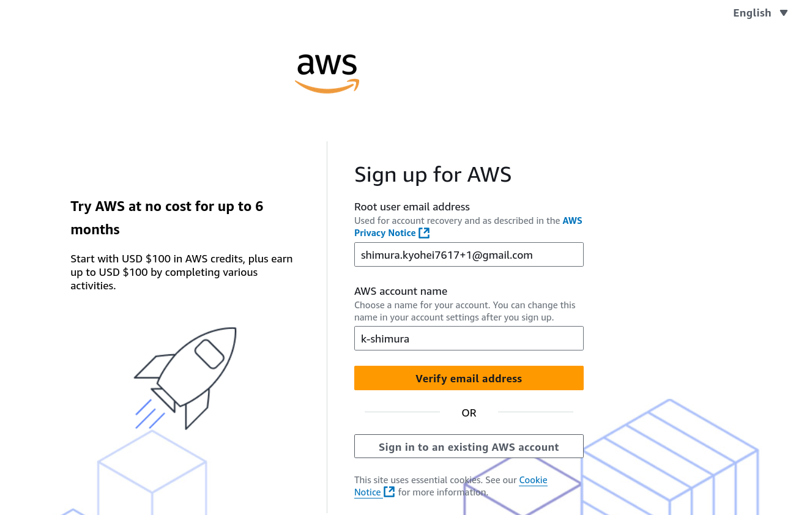
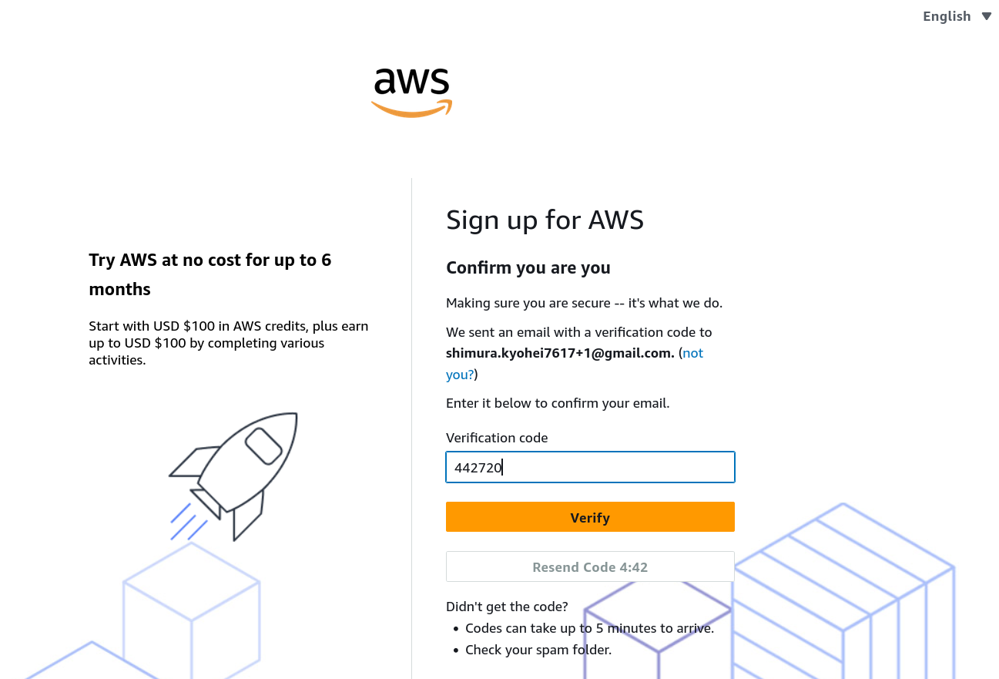
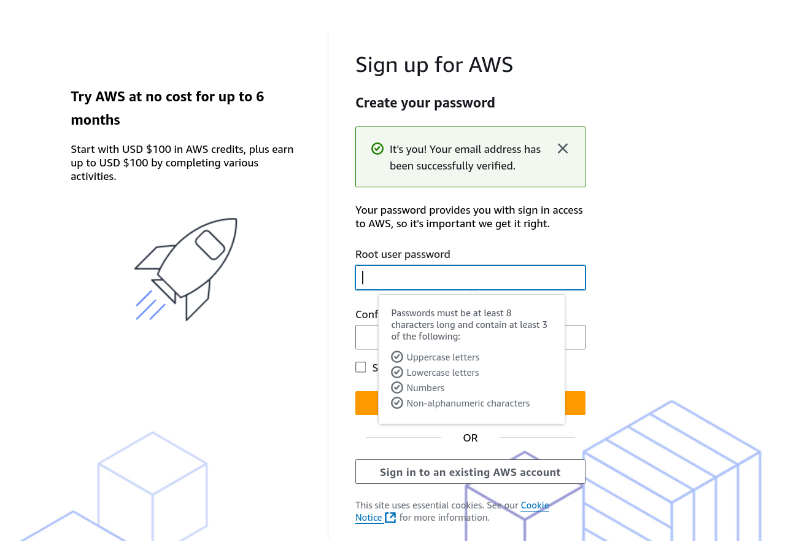
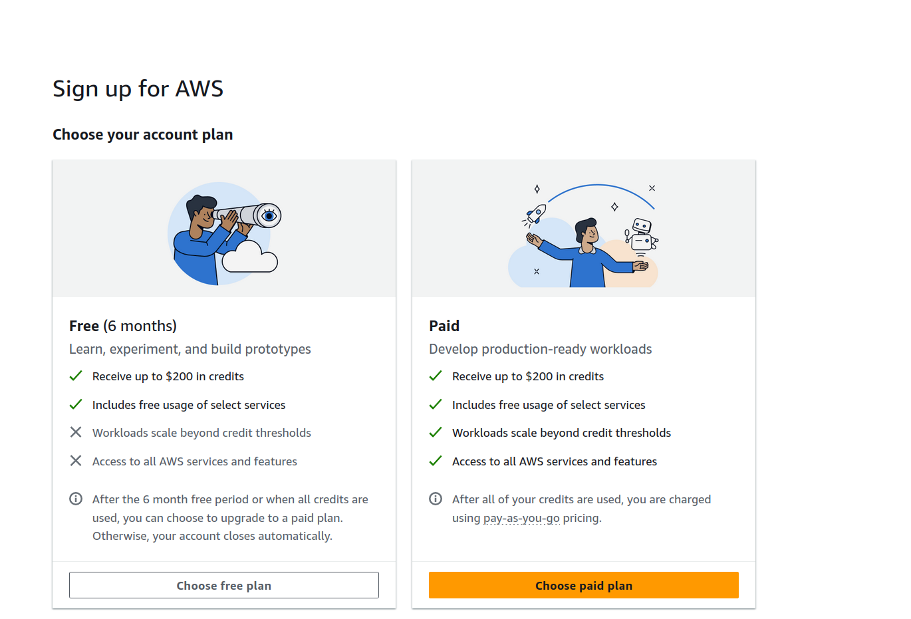
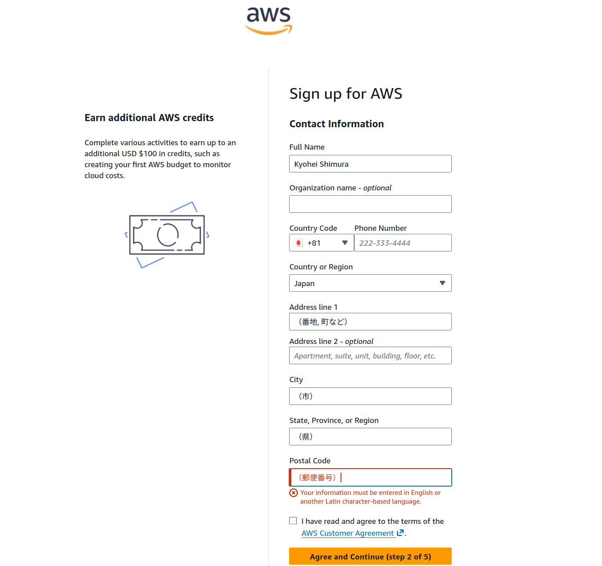
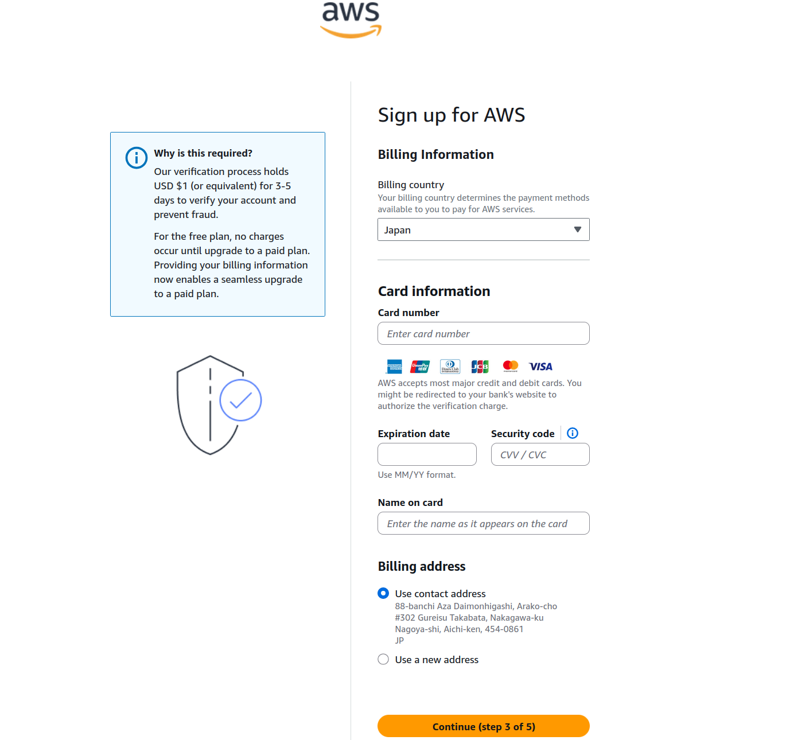
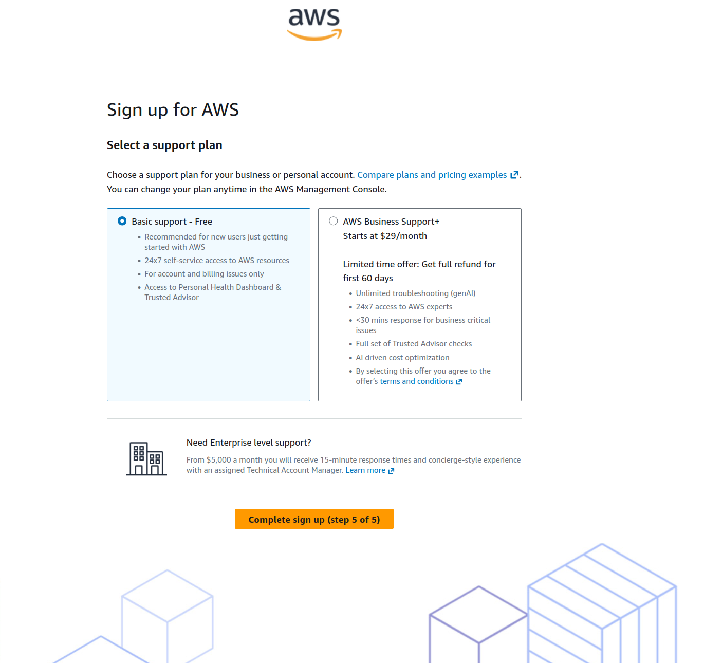
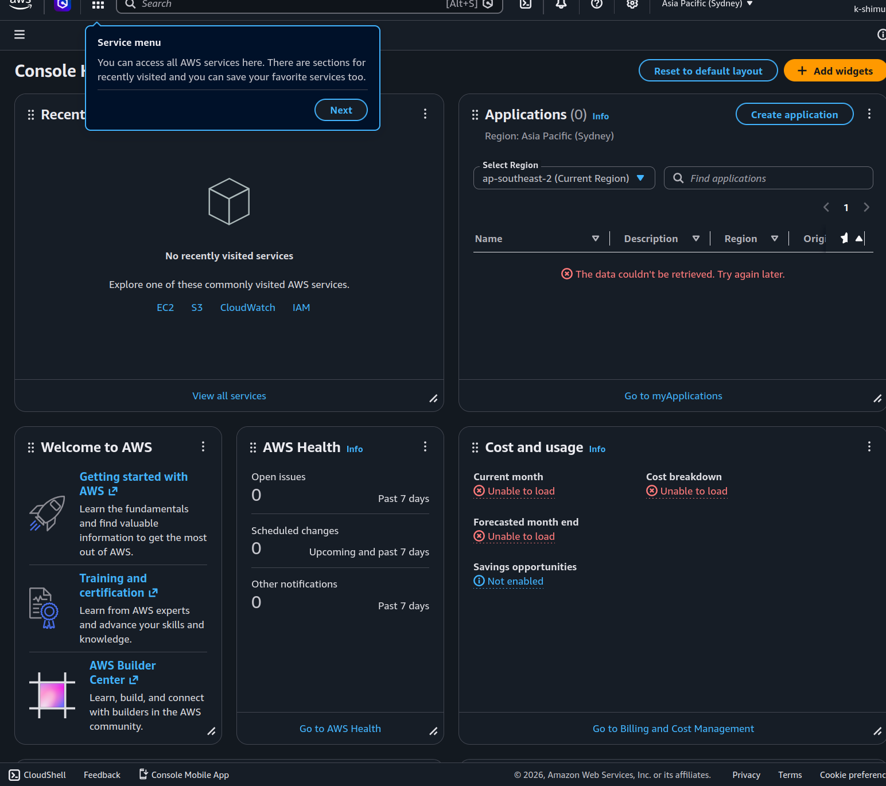
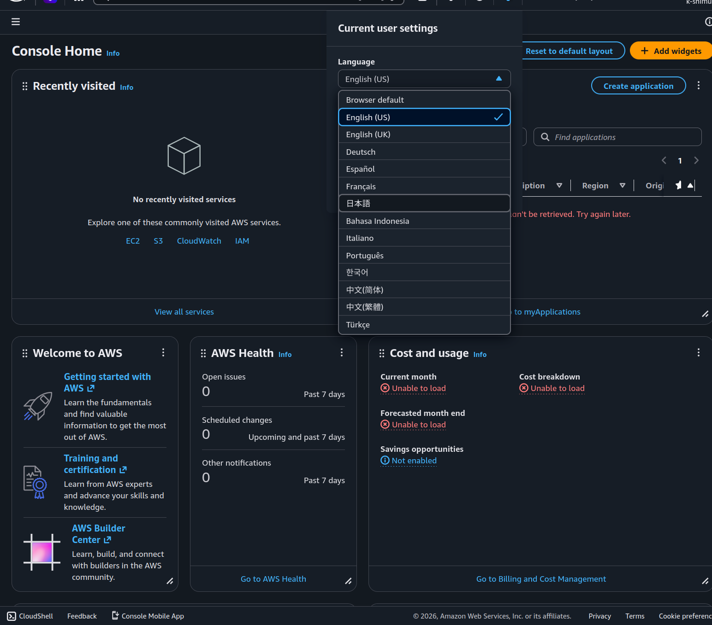

# AWSアカウント作成手順

この手順では、AWSアカウント作成画面を開くところまでを確認します。
スクリーンショットは、実際の画面に合わせてあとから追加します。

## 1. AWSにアクセスする

[AWS公式サイト](https://aws.amazon.com/jp/) にアクセスします。

## 2. アカウントの作成を押下する

[AWSアカウント作成画面](https://signin.aws.amazon.com/signup?request_type=register) を開きます。

AWS公式サイト上では、`アカウントの作成` を押下します。  
Sign upを進めます。  
※（英語で住所入力などあるため）英語画面で進めますが、画面右上の`English`を`日本語`にするとわかりやすいです。  
なお、切り替えはいつでもできます。

アカウントプランを選択します。  
勉強やお試しならFreeプランを選択しましょう。  
最大200USDクレジットもらえます。  
クレジット使い切りか6か月経過で、アカウント閉鎖かPaidプラン移行を選択できます。  
昔はプラン選択なく、Paid一択でした。  
無料でAWSのハードルが下がって素敵ですね。  

英語の住所入力が必要です。  
以下のサイトを使うと簡単です。  
[住所の英語変換](https://kimini.jp/)  
入れる内容のサンプルです。  

クレカの登録だけ必要ですが、Freeプランなら支払い発生しないのでご安心を。

サポートプラン、個人使用はFreeです。  

少し待つとアカウントが完成します。  

言語は画面上部の歯車から変えられます。  

