# AWSアカウント初期設定手順

この手順では、AWSアカウント作成後に行う初期設定を確認します。  
アカウント作成直後はセキュリティリスクがあります。  
最低限の操作で安全に運用できるアカウント設計を実施します。

目安: 90分

## 1. AWSマネジメントコンソールにサインインする

AWSマネジメントコンソールにサインインします。  
※サインイン中ならサインアウトします。画面右上のユーザー名をクリックし、サインアウトを押下します。

コンソールにサインインを押下します。
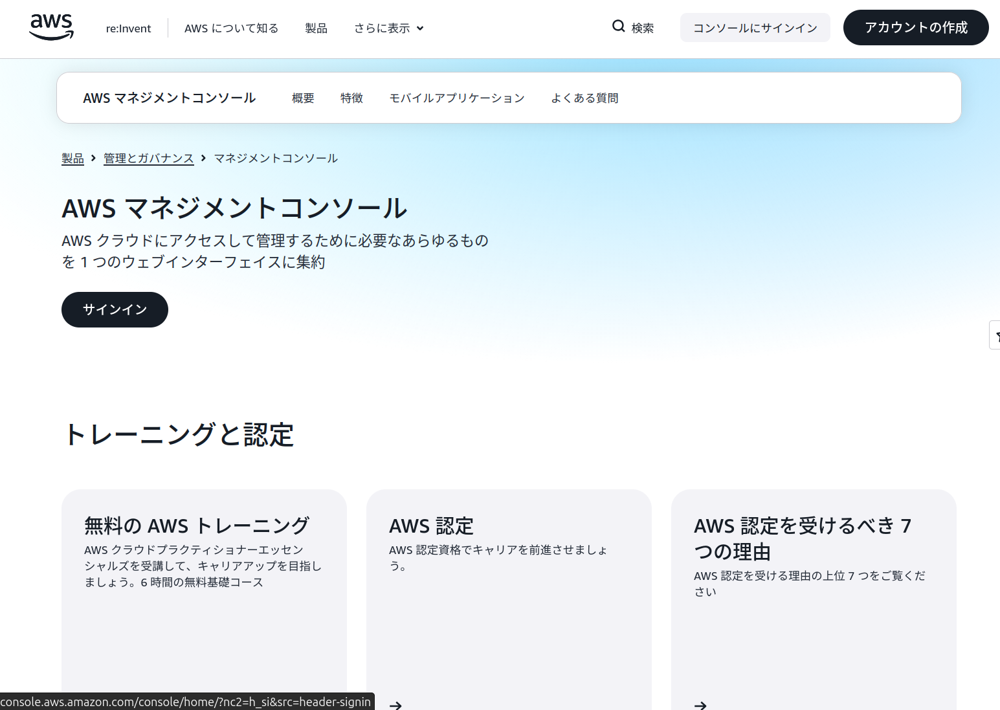

ルートユーザーのEメールを使用したサインインを押下します。
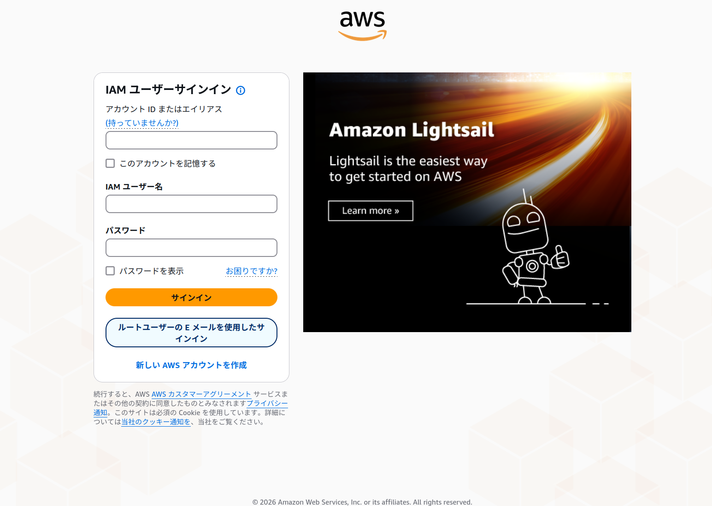

メールアドレスとパスワードはsignupで登録した値を入力します。
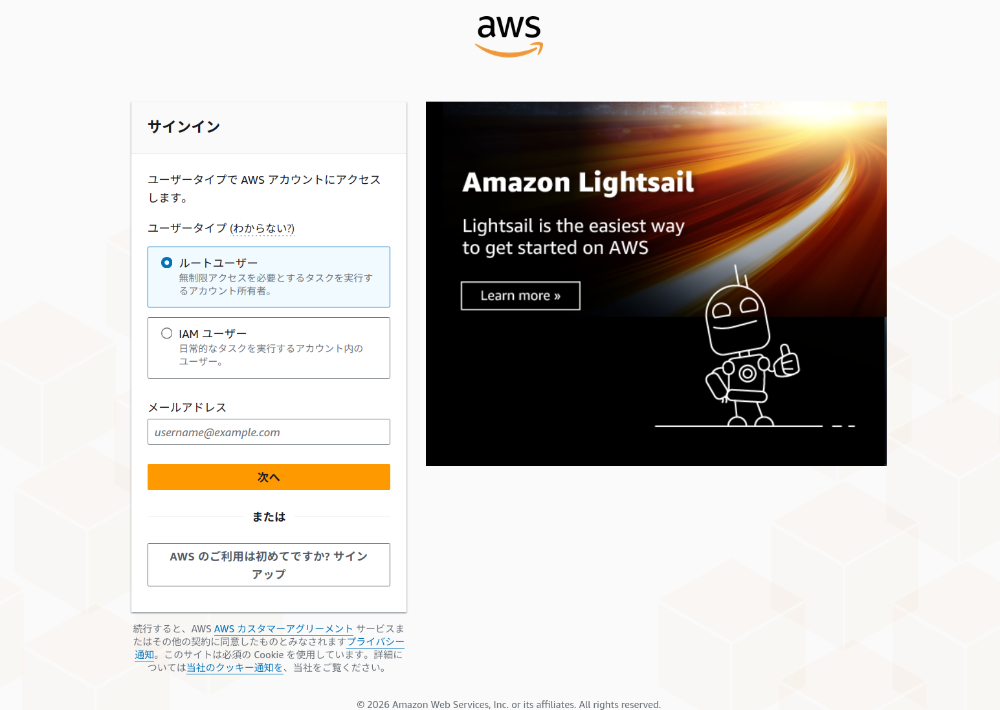

## 2. rootユーザーのMFAを設定する

rootユーザーに多要素認証（MFA）を設定します。

MFA登録をする。  
公式はパスキー推奨ですが、実情は認証アプリが一般的です。  
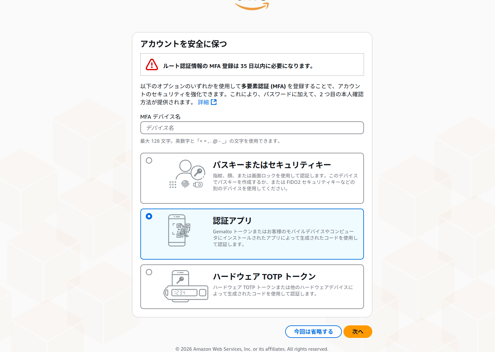

スマホで任意のAuthアプリを用いてMFAデバイスを登録します。  
成功すると以下の画面になるため、確認してコンソールに続行を押下します。
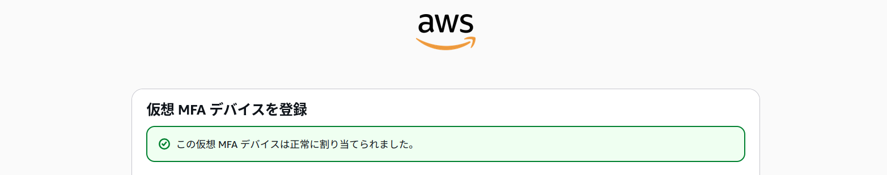

ここまででrootユーザーの保護は完了です。  
アカウント作成直後の設定は入力も確認も多くて疲れますが、AWSを安全に使うための大事な山場です。  
可愛いカニちゃんでも見て少し休憩しましょう。

加えて紅茶でも入れましょう。

癒やし摂取ができたら、普段使う作業用ユーザーの設定に進みましょう。

## 3. 作業用ユーザーを作成する

今後の作業では、rootユーザーではなく作業用のIAMユーザーでログインできるように設定します。  
rootユーザーはアカウント全体に対する強い権限を持つため、初期設定や緊急時以外では非推奨です。

### 3-1. IAMを開く

AWSマネジメントコンソールの検索欄で `IAM` を検索し、IAMの画面を開きます。

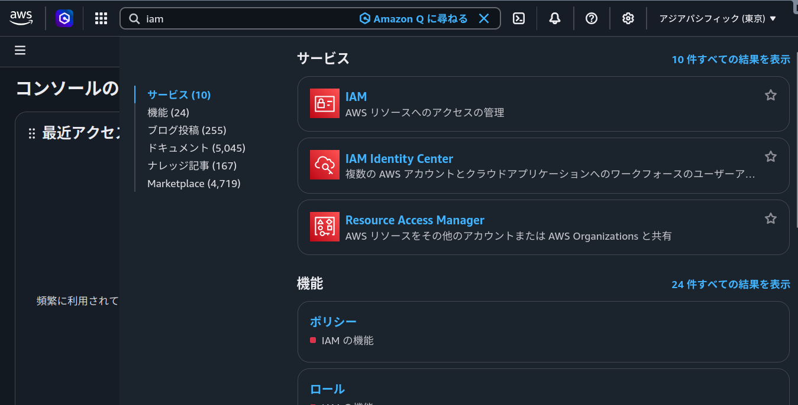

※今回はIAMを用いますが、Identity Centerを使うとより安全でAWS推奨の運用ができます。  
業務利用でもIAMが多いため参考までに。
[AWS アカウント作成後にすぐやるべきこと](https://qiita.com/su_j0shuA/items/d6092e3b4fbae3b513d4)

### 3-2. ユーザー作成画面を開く

左メニューから `IAMユーザー` > `ユーザーの作成` を押下します。

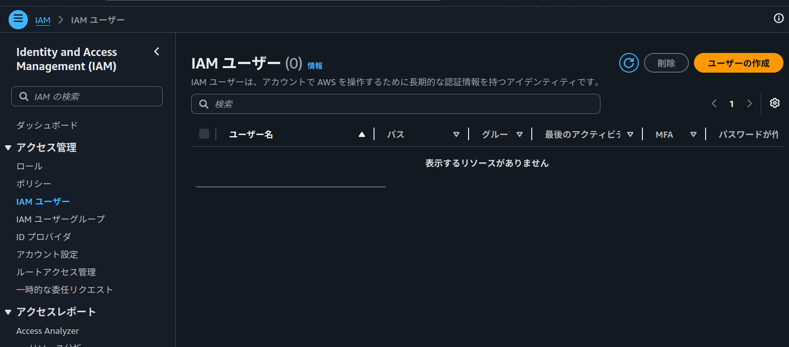

### 3-3. ユーザーを作成する

作業用ユーザー名を入力します。  
AWSマネジメントコンソールへのユーザーアクセスにチェックします。

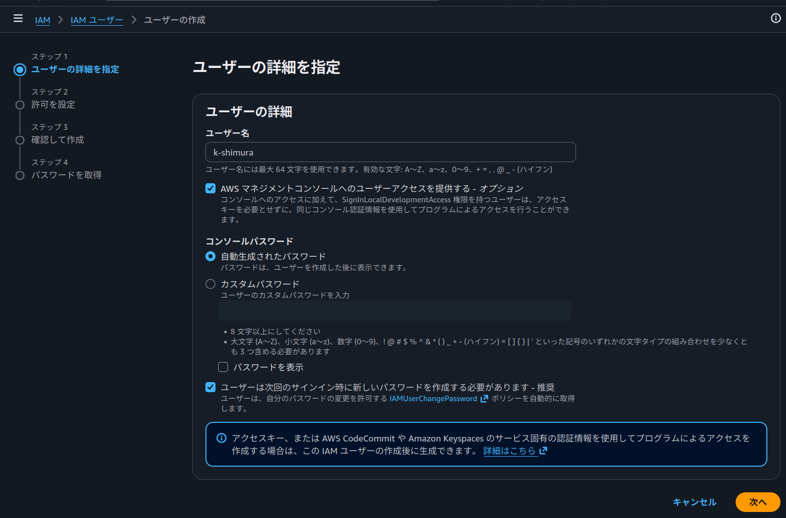

グループを作成します。

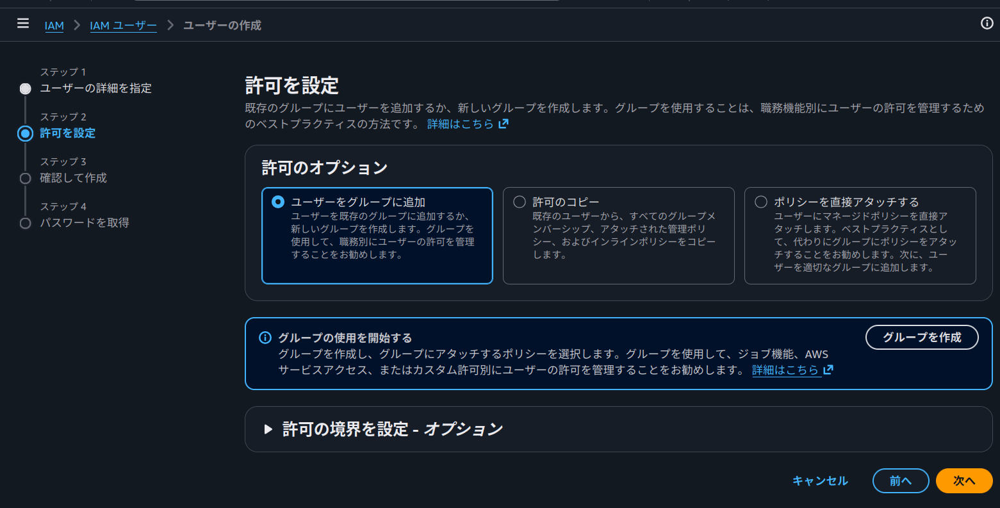

ユーザーグループ名を入力します。  
許可ポリシーから`AdministratorAccess`をチェックして作成します。

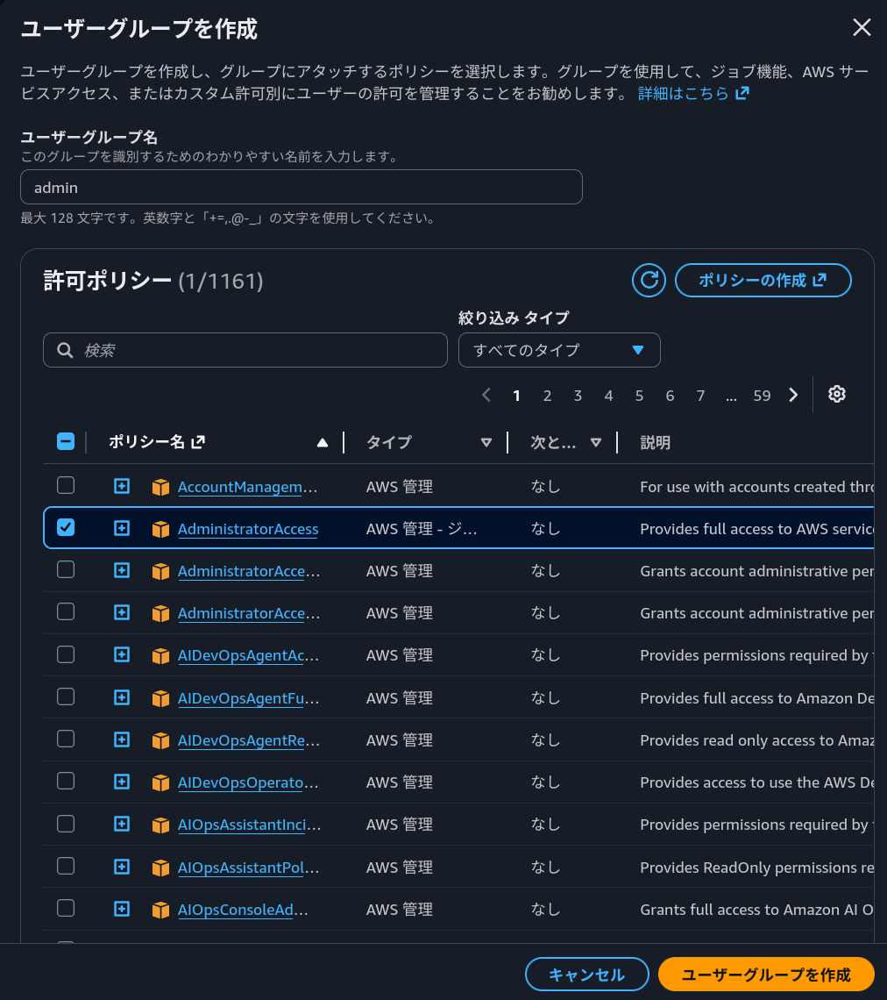

※`AdministratorAccess`はAWS内の多くの操作を実行できる強い権限です。

実務では必要な権限だけを付与する最小権限が推奨です。

作成したグループをチェックして次へ、ユーザの作成の押下に進みます。
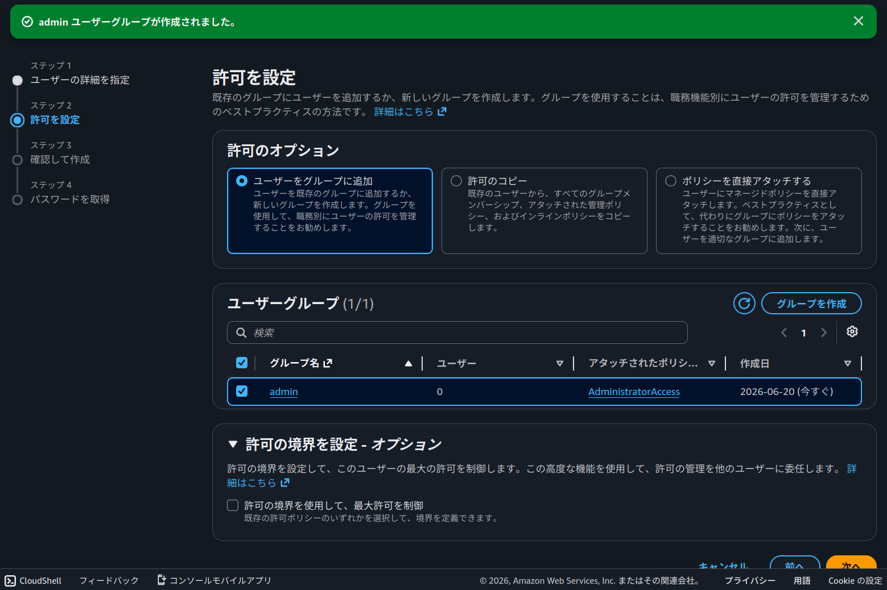

### 3-4. ユーザーを作成する

作成後にサインイン情報が表示されるため、.csvファイルをダウンロードして安全に保管します。

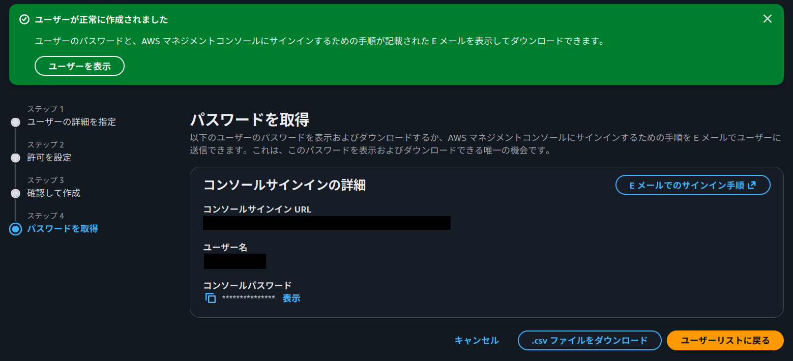

### 3-5. rootユーザーからサインアウトする

rootユーザーからサインアウトします。  
画面右上のユーザー名をクリックし、サインアウトを押下します。

### 3-6. 作業用ユーザーでサインインする

3-4でダウンロードした.csvを開き、コンソールサインインURLからサインイン画面に遷移します。  
.csvのユーザー名、パスワードでサインインします。  
パスワードのリセットを行います。  
今後の作業はこの作業用ユーザーで行います。

### 3-7. 作業用ユーザーにもMFAを設定する

作業用IAMユーザーにもMFAを設定します。  
不正ログインのリスクを下げられます。

1. 画面右上のユーザー名をクリックします。
2. `セキュリティ認証情報` を押下します。
   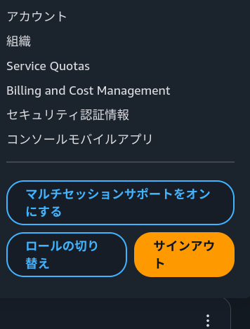
3. `MFAを割り当てる` を押下します。
   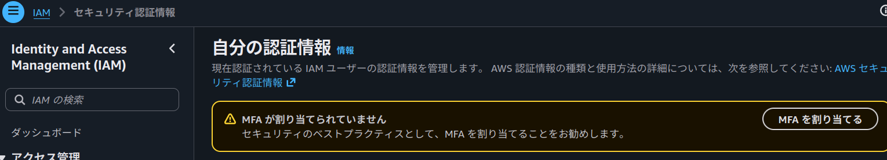
4. rootユーザーの設定と同様にMFAを追加します。

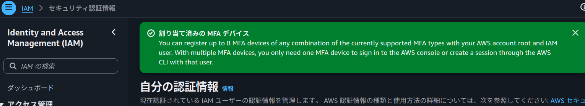

## 4. その他作業

AWSを快適に操作する設定を行います。

### 4-1. リージョンを設定する

AWSでは、サービスをどのリージョン（国・地域）に作成するかを決められます。  
リージョンによって値段や遅延、サービスの充実性など違いがありますが、基本的には東京リージョンを使います。  
画面上部の国名を選択し、東京に変更します。  
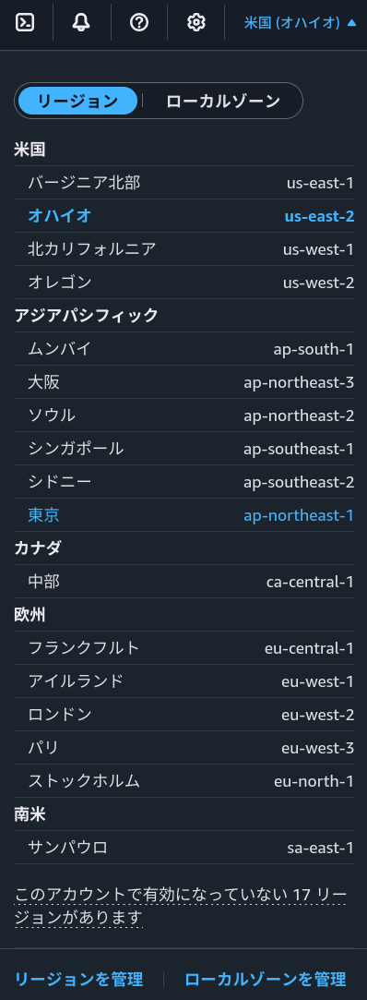
アジアパシフィック(東京)になりました。  
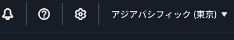
今後のハンズオンでサービスを作成する際は、リージョンが東京であるかを意識しましょう。  
※一部サービス（IAMなど）では、リージョンがグローバルになります。  
これをグローバルサービスといい、サービスがリージョンの外側で紐付いているため、東京でなくても正常な設定になっています。

## 5. 実施したことのまとめ

この初期設定では、AWSアカウントを安全に使い始めるために次の作業を行いました。

- rootユーザーでAWSマネジメントコンソールにサインインした
- rootユーザーにMFAを設定した
- 作業用IAMユーザーを作成した
- `AdministratorAccess` を持つユーザーグループを作成した
- 作業用IAMユーザーをユーザーグループに追加した
- rootユーザーからサインアウトし、作業用IAMユーザーでサインインした
- 作業用IAMユーザーにもMFAを設定した
- リージョンを東京に設定した

AWSの初期設定は、アカウント、MFA、IAM、リージョンなど確認することが多く、かなり大変です。  
ここまでの作業で、安全にハンズオンを進められる状態になりました。  
お疲れさまでした！

ペンちゃんを眺めましょう。愛でましょう。  

んー、シュールですね。  

