# S3単体の静的ウェブサイトホスティング手順

この手順では、Amazon S3単体で静的ウェブサイトとして公開します。  
S3単体公開は構成が簡単ですが、S3ウェブサイトエンドポイントはHTTPSに対応しません。

目安: 90分

## 参考サイト

- [【小ネタ】Amazon S3 で静的ウェブサイトホスティングを試してみた](https://dev.classmethod.jp/articles/aws-s3-web-iwazaki/)

## 前提

- AWSアカウントが作成済みである
- AWSマネジメントコンソールへサインインできる
- 静的ファイルが手元にある

公開に必要なファイル:

```text
index.html
styles.css
script.js
assets/icon.svg
```

## 手順

1. AWSマネジメントコンソールでS3を開きます。  
   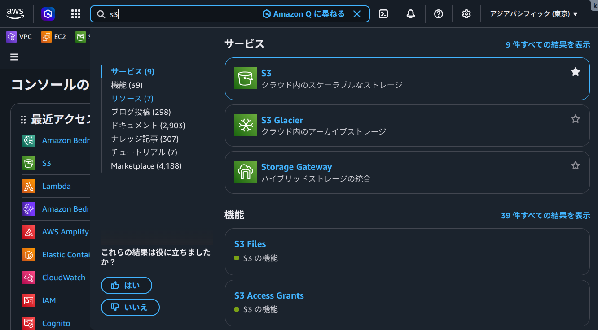
2. `バケットを作成` を押下します。  
   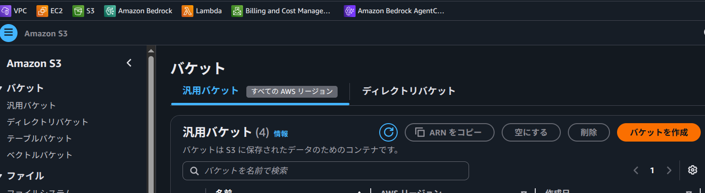
   初作成時は、以下のような画面から押下します。  
   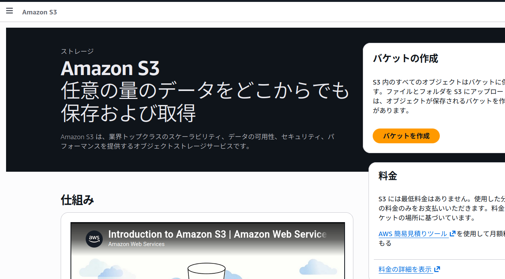
3. バケット名を入力します。  
   バケット名前空間は `アカウントのリージョナル名前空間 (推奨)` を選択します。  
   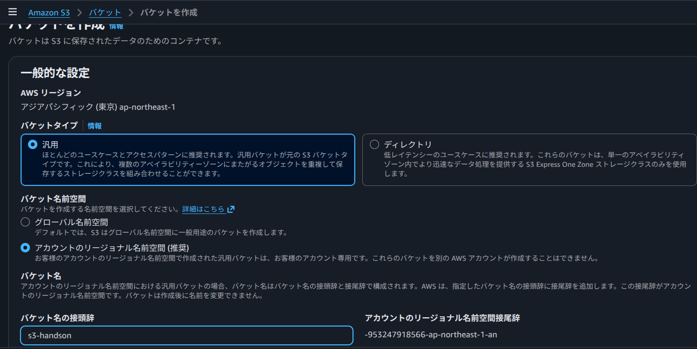
   以前は全世界のAWSアカウントで一意の名前にする必要がありましたが、この設定で自分専用の任意バケット名を付けられます。
4. ブロックパブリックアクセスのチェックを外します。  
   `パブリックアクセスをすべてブロック` のチェックを外し、画面下の確認メッセージにチェックします。  
   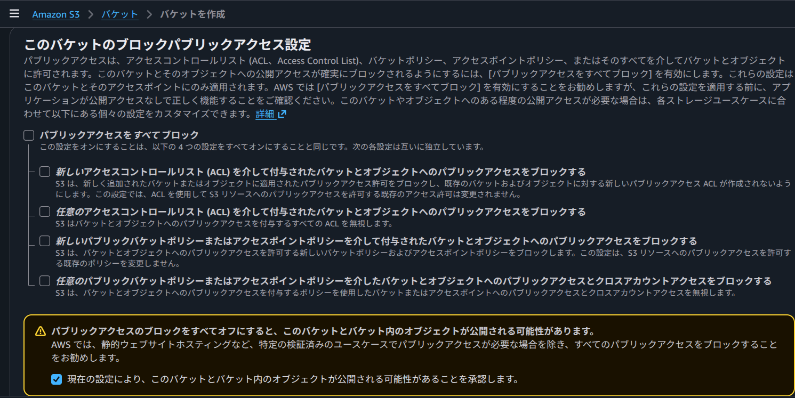
   S3のメイン機能はストレージのため、静的サイト公開以外では基本的に外しません。  
   保存ファイルが全世界に公開される可能性があります。
5. バケットを作成します。  
   上記以外の項目はデフォルトのまま作成します。  
   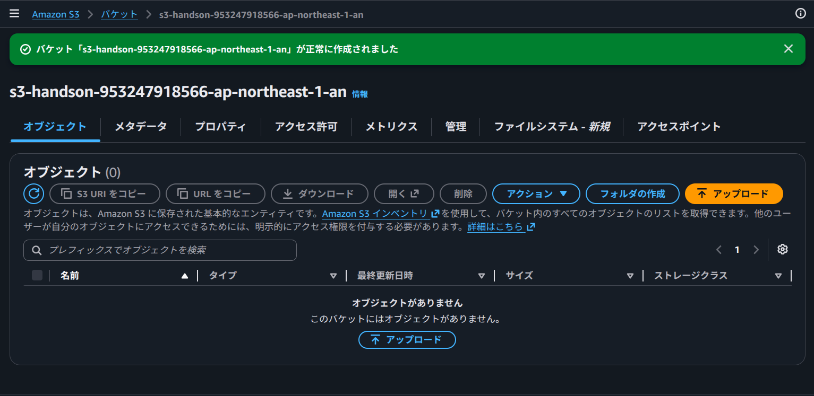
6. `プロパティ` タブから `静的ウェブサイトホスティング` を編集します。  
   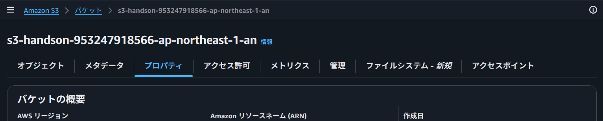
   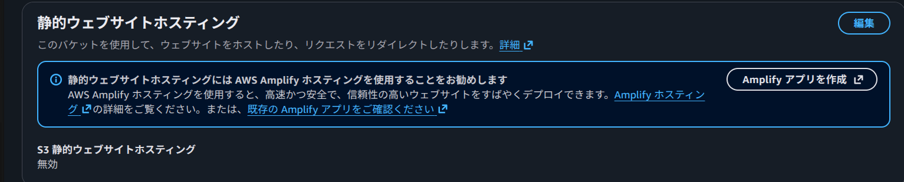
7. 静的ウェブサイトホスティングを有効化します。  
   インデックスドキュメントには `index.html` を指定し、変更を保存します。  
   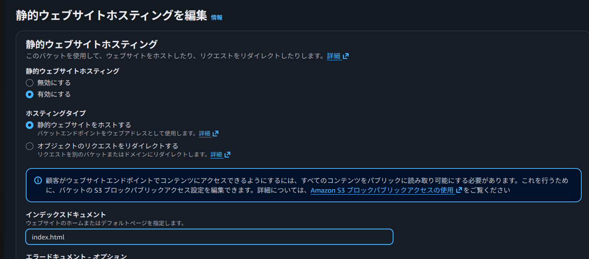
8. `オブジェクト` タブで静的ファイルをアップロードします。  
   S3バケットには、公開したいHTML、CSS、JavaScript、画像などを格納します。  
   アップロード画面からファイルを追加できます。`オブジェクト` タブに直接ファイルをドラッグ&ドロップしても追加できます。  
   追加対象ファイルにチェックを入れてアップロードします。  
   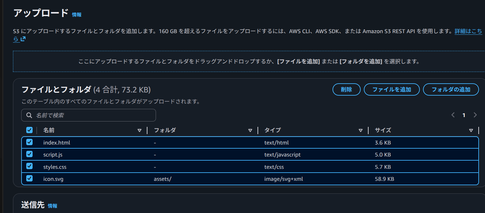

   このサンプルでアップロードする対象:

   ```text
   index.html
   styles.css
   script.js
   assets/
   ```

9. アップロード後、`オブジェクト` タブにファイルが表示されることを確認します。  
   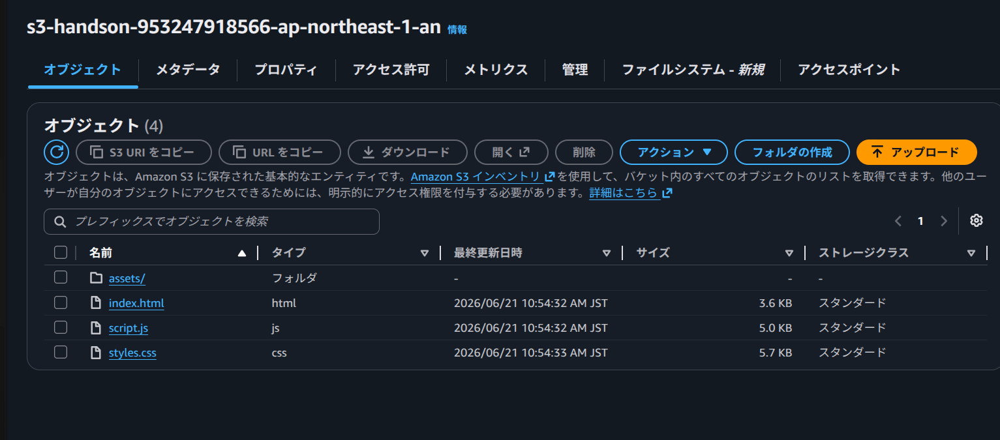
10. `アクセス許可` タブでバケットポリシーを編集します。  
    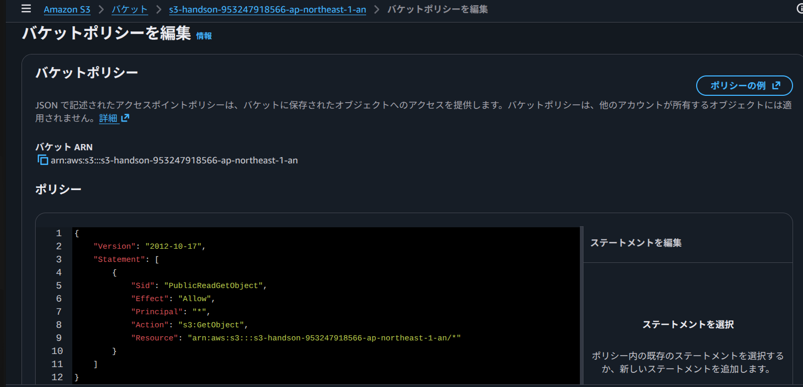
    以下のJSONをポリシーにペーストします。  
    `Resource` の値のみ、`<バケットARNの値>/*` に置き換えて、変更を保存します。

    ```json
    {
      "Version": "2012-10-17",
      "Statement": [
        {
          "Sid": "PublicReadGetObject",
          "Effect": "Allow",
          "Principal": "*",
          "Action": "s3:GetObject",
          "Resource": "<バケットARNの値>/*"
        }
      ]
    }
    ```

11. `プロパティ` タブで、静的ウェブサイトホスティングのバケットウェブサイトエンドポイントを開きます。  
    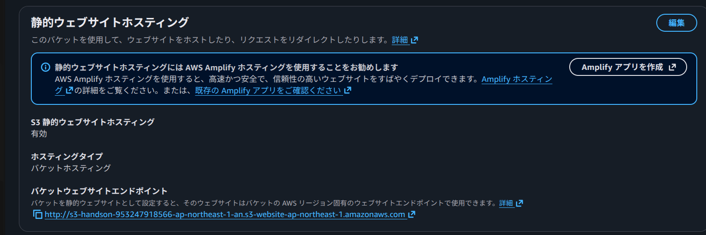
    手順8でアップロードしたサイトが開きます。  
    軽く動作確認をして、ホスティング完了です。  
    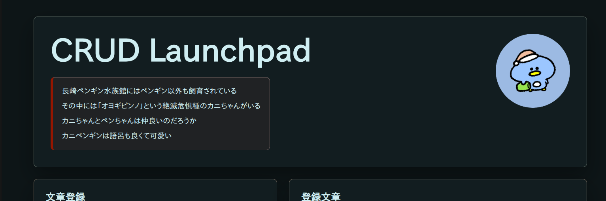

## Appendix

### 注意点

- S3ウェブサイトエンドポイントはHTTPSに対応しない
- 公開するにはオブジェクトをパブリックに読める必要がある
- 本番向けにはS3 + CloudFront構成を優先する
- 作業後に不要になったバケットは削除する

### 確認ポイント

- `index.html` が表示されること
- CSSとJavaScriptが読み込まれること
- `assets/icon.svg` が表示されること
- 文章の登録、検索、更新、削除が動くこと
- リロード後もlocalStorageのデータが残ること
