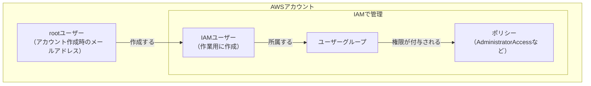
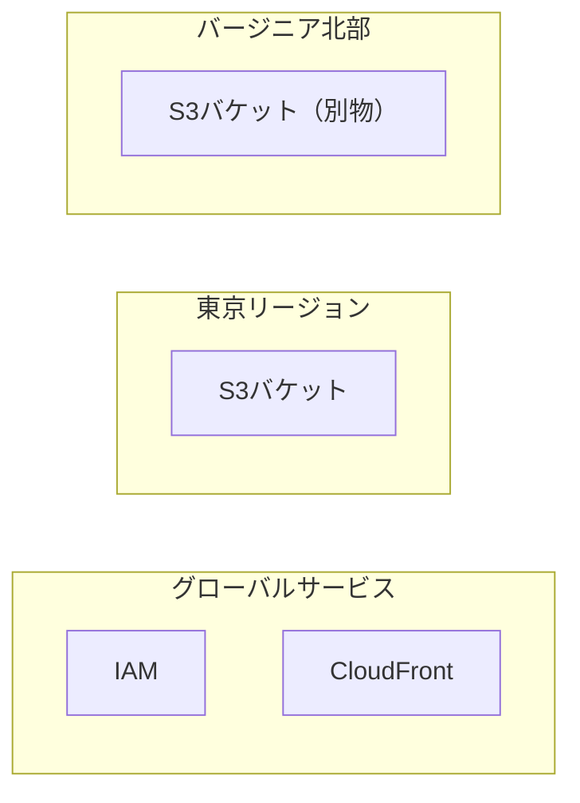

# 用語集: AWSアカウント作成・初期設定

[AWSアカウント作成手順](00-account-signup.md)・[AWSアカウント初期設定手順](01-account-initial-setup.md)に出てくる用語の解説です。  
手順の途中で「これ何？」となったときに、辞書代わりにご活用ください。  
※参考に公式ドキュメントつけていますが、わかりにくいので私に聞いてください・・・！

## 目次

- [用語集: AWSアカウント作成・初期設定](#用語集-awsアカウント作成初期設定)
  - [目次](#目次)
  - [AWSマネジメントコンソール](#awsマネジメントコンソール)
  - [rootユーザーとIAMユーザー](#rootユーザーとiamユーザー)
  - [IAM（Identity and Access Management）](#iamidentity-and-access-management)
  - [ポリシーとユーザーグループ](#ポリシーとユーザーグループ)
  - [MFA（多要素認証）](#mfa多要素認証)
  - [アクセスキーとシークレットアクセスキー](#アクセスキーとシークレットアクセスキー)
  - [IAM Identity Center](#iam-identity-center)
  - [リージョンとグローバルサービス](#リージョンとグローバルサービス)
  - [関連リンク](#関連リンク)

---

## AWSマネジメントコンソール

> [!NOTE]
> ブラウザからAWSを操作する管理画面

AWSの操作方法にはコンソール（ブラウザ）、CLI（コマンド）、SDK（プログラム）の3つがあります。  
このハンズオンではすべてコンソールで操作します。

| 操作方法                                  | ユースケース                             | ハンズオンでの登場 |
| ----------------------------------------- | ---------------------------------------- | ------------------ |
| マネジメントコンソール（マネコン）        | 画面で確認しながら操作したいとき         | 全手順で使用       |
| AWS CLI（awsコマンドでEC2にアクセスとか） | コマンドで自動化・繰り返し操作したいとき | 使用しない         |
| SDK（私がやってたLambdaでAI呼ぶやつとか） | アプリのコードからAWSを呼び出すとき      | 使用しない         |

**つまずきポイント**

- コンソールの画面レイアウトは頻繁に変わります。
  - 手順書のスクリーンショットと多少違っても、ボタンの文言を頼りに探してください。
- 画面上部の検索欄にサービス名（`IAM` や `S3`）を入れるのが最速の移動手段です。
  - 画面左部にサービスが隠れていたりするため、困ったら上か左か私に質問をしましょう。

**公式ドキュメント**: [AWS マネジメントコンソールの使用](https://docs.aws.amazon.com/ja_jp/awsconsolehelpdocs/latest/gsg/getting-started.html)

---

## rootユーザーとIAMユーザー

> [!NOTE]
> rootは「アカウントの持ち主」、IAMユーザーは「アカウント内で作る作業者」

初期設定手順の中心になる考え方です。  
アカウント作成時のメールアドレスでサインインするのがrootユーザーです。  
その後IAMで作成するのが作業用のIAMユーザーです。  
現場で使っていたのはIAMユーザーです。

| 比較項目       | rootユーザー                                   | IAMユーザー                            |
| -------------- | ---------------------------------------------- | -------------------------------------- |
| 正体           | アカウントそのものの持ち主                     | アカウント内に作る作業者               |
| サインイン方法 | メールアドレス + パスワード                    | アカウントID + ユーザー名 + パスワード |
| 権限           | すべての操作が可能。制限できない               | ポリシーで付与された範囲のみ           |
| できる人数     | アカウントに1つだけ                            | 何人でも作成できる                     |
| 権限の剥奪     | 不可能                                         | いつでも変更・削除できる               |
| 普段の作業     | 使わない                                       | こちらを使う                           |
| 使う場面       | 初期設定、アカウント解約、支払い設定の一部など | 日常のすべての作業                     |

**なぜrootを普段使いしないのか**

rootユーザーは権限を制限する手段がありません。  
もしrootの認証情報が漏れると？  
→サービス全削除・全設定変更・高額サービス起動など、何でもされてしまいます。  
IAMユーザーなら漏れても「付与した権限の範囲」で被害が止まり、無効化もできます。

`TIPS:` 家に例える

- rootは「家の所有権ごと渡す実印」
- IAMユーザーは「渡す相手ごとに作る合鍵」
- 合鍵は紛失したら鍵を交換すれば済みますが、実印は家ごと持っていかれます。

**つまずきポイント**

- サインイン画面で「ルートユーザー」「IAMユーザー」の選択があり、初見で迷いがちです。
- メールアドレスで入るならroot
- アカウントID＋ユーザー名で入るならIAMユーザーです。

**公式ドキュメント**: [AWS アカウントのルートユーザーのベストプラクティス](https://docs.aws.amazon.com/ja_jp/IAM/latest/UserGuide/root-user-best-practices.html)

---

## IAM（Identity and Access Management）

> [!NOTE]
> AWSの「誰が・何を・できるか」を管理するサービス

読み方は「アイアム」です。  
ユーザー（誰が）、ポリシー（何をできるか）、グループ（まとめて管理）を扱います。

IAM自体は無料で、どれだけユーザーやポリシーを作っても料金はかかりません。

**つまずきポイント**

- コンソールで `IAM` を検索すると「IAM」と「IAM Identity Center」の両方が出てきます。
- 本ハンズオンで使うのは無印の「IAM」です（違いは[IAM Identity Center](#iam-identity-center)を参照）
- IAMの画面ではリージョンが「グローバル」と表示されます。
  - IAMがリージョンに属さないサービスだからです（[グローバルサービス](#リージョンとグローバルサービス)を参照）

**公式ドキュメント**: [IAM とは](https://docs.aws.amazon.com/ja_jp/IAM/latest/UserGuide/introduction.html)

---

## ポリシーとユーザーグループ

> [!NOTE]
> ポリシーは「許可リスト」、グループは「ポリシーをまとめて配る箱」

**ポリシー**は「S3の読み取りを許可」「EC2の起動を許可」のような許可ルールの集まりです。  
手順書で選ぶ `AdministratorAccess` はAWSが用意しているポリシーの1つで、ほぼ全操作を許可する権限です。

**ユーザーグループ**はユーザーをまとめる箱で、グループにポリシーを付けると所属ユーザー全員にその権限が届きます。  
グループ経由にしておくと、後からメンバーや権限を変えやすくなります。

**最小権限の原則**

実務では「その作業に必要な権限だけを付与する」考え方が基本で、これを最小権限の原則と呼びます。  
`AdministratorAccess` はこの原則から外れますが、学習用の個人アカウントでは「権限不足のエラーで止まらないこと」を優先してよく採用します。

> [!WARNING]
> 会社のAWSアカウントで `AdministratorAccess` を要求すると渋い顔をされます。  
> 実務では必要な権限を絞りましょう。

**公式ドキュメント**: [IAM でのポリシーとアクセス許可](https://docs.aws.amazon.com/ja_jp/IAM/latest/UserGuide/access_policies.html)

---

## MFA（多要素認証）

> [!NOTE]
> パスワードに加えて「もう1つの証明」を要求する仕組み

Multi-Factor Authenticationの略です。  
パスワードが漏れても、スマホの認証アプリが手元にない限りサインインできなくなります。

| 方式             | 内容                                    | 手順書での扱い                  |
| ---------------- | --------------------------------------- | ------------------------------- |
| 認証アプリ       | スマホアプリが30秒ごとに6桁コードを生成 | これを使う                      |
| パスキー         | 指紋・顔認証など端末の生体認証          | AWS公式の推奨だが今回は使わない |
| ハードウェアキー | YubiKeyなどの物理デバイス               | 使わない                        |

認証アプリはGoogle Authenticator、Microsoft Authenticatorなど、どれでも使えます。  
※私は`Authy`というニッチなアプリを使っています。

**つまずきポイント**

- rootユーザーと作業用IAMユーザーは別々にMFA登録が必要です。
  - 1回設定して終わりではありません

**公式ドキュメント**: [AWS での多要素認証（MFA）](https://docs.aws.amazon.com/ja_jp/IAM/latest/UserGuide/id_credentials_mfa.html)

---

## アクセスキーとシークレットアクセスキー

> [!NOTE]
> 人間用のパスワードに対する、プログラム用のパスワード

現場でAWS CLIを触った時の、`aws configure` で入力した2つの文字列です。

| 認証情報                                | 使う主体   | 使う場面                             |
| --------------------------------------- | ---------- | ------------------------------------ |
| ユーザー名 + パスワード                 | 人間       | マネジメントコンソールへのサインイン |
| アクセスキー + シークレットアクセスキー | プログラム | AWS CLI、SDK、CI/CDからのアクセス    |

アクセスキーは「ユーザーID」に、シークレットアクセスキーは「パスワード」に相当するペアです。  
IAMユーザーに対して発行します。  
このキーを持つプログラムは、そのIAMユーザーの権限をそのまま使えます。

**※このハンズオンでは作成しません**

コンソール操作だけで完結するため、アクセスキーは発行しません。  
使わない認証情報を持たないことも立派なセキュリティ対策です。  
→ECS on Fargateのハンズオンで少しだけCLI使います。

> [!WARNING]
> アクセスキーをGitHubにpushしてしまう事故は現場でも定番です。  
> 公開リポジトリに漏れると数分でbotに拾われ、暗号資産マイニング用の高額インスタンスを大量起動されます。  
> キーをコードに直接書かない、`.gitignore` で認証情報ファイルを除外する、が鉄則です。

**つまずきポイント**

- シークレットアクセスキーは発行直後の1回しか表示されません。
  - 控え忘れたら再発行（古いキーの無効化）になります
- rootユーザーのアクセスキーは作成しないでください。
  - rootの全権限がプログラムに渡る最悪の構成です

**公式ドキュメント**: [IAM ユーザーのアクセスキーの管理](https://docs.aws.amazon.com/ja_jp/IAM/latest/UserGuide/id_credentials_access-keys.html)

---

## IAM Identity Center

> [!NOTE]
> 複数アカウント・複数人での利用を前提とした、新しめのサインイン管理サービス

IAMを検索すると隣に出てくるサービスです。  
一時的な認証情報を使うためアクセスキーの漏洩リスクが減り、AWSはこちらの利用を推奨しています。

このハンズオンでIAMユーザーを使うのは、次の理由です。

- 個人の学習アカウントでは構成がシンプルで済む
- 業務では依然としてIAMユーザー運用が多く、先に慣れておく価値がある

「Identity Centerという推奨ルートもある」とだけ覚えておけば十分です。

**公式ドキュメント**: [IAM Identity Center とは](https://docs.aws.amazon.com/ja_jp/singlesignon/latest/userguide/what-is.html)

---

## リージョンとグローバルサービス

> [!NOTE]
> リージョンはAWSのデータセンター群がある「地域」。作ったリソースはその地域に置かれる

AWSは世界中にリージョン（東京、大阪、バージニア北部など）を持ち、S3バケットなどのリソースは「どのリージョンに作るか」を選びます。

日本からは、通信の遅延が小さい東京リージョン（`ap-northeast-1`）を使うのが基本です。

**グローバルサービス**

IAMやCloudFrontなど一部のサービスはリージョンに属さず、画面右上の表示が「グローバル」になります。  
東京を選んだはずなのに表示が変わっていても、正常な動作です。

**つまずきポイント**

- 「作ったはずのS3バケットが見つからない」の原因の大半は、リージョンが別の場所に切り替わっていることです。
  - リソースが見当たらないときは、まず画面右上のリージョン表示を確認しましょう
- リージョンによって料金が微妙に違います。
  - 手順書通り東京で統一すれば問題ありません

**公式ドキュメント**: [リージョンとアベイラビリティーゾーン](https://aws.amazon.com/jp/about-aws/global-infrastructure/regions_az/)

---

## 関連リンク

- [AWSアカウント作成手順](00-account-signup.md)
- [AWSアカウント初期設定手順](01-account-initial-setup.md)
- [AWS公開手順の入口](README.md)
