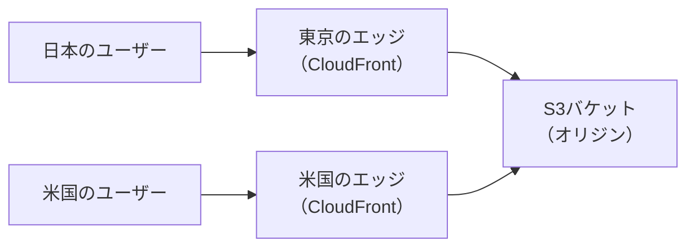
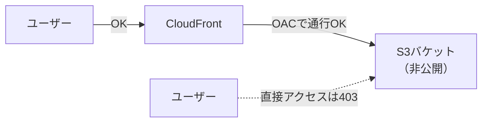

# 用語集: S3 + CloudFront公開

[S3 + CloudFront 静的サイト公開手順](04-s3-cloudfront-hosting.md)に出てくる用語の解説です。  
手順の途中で「これ何？」となったときに、辞書代わりにご活用ください。  
※参考に公式ドキュメントつけていますが、わかりにくいので私に聞いてください・・・！

## 目次

- [用語集: S3 + CloudFront公開](#用語集-s3--cloudfront公開)
  - [目次](#目次)
  - [CDNとCloudFront](#cdnとcloudfront)
  - [ディストリビューション](#ディストリビューション)
  - [オリジン](#オリジン)
  - [OAC（Origin Access Control）](#oacorigin-access-control)
  - [HTTPSとTLS証明書](#httpsとtls証明書)
  - [キャッシュとインバリデーション](#キャッシュとインバリデーション)
  - [WAF（Web Application Firewall）](#wafweb-application-firewall)
  - [関連リンク](#関連リンク)

---

## CDNとCloudFront

> [!NOTE]
> CDNは世界中に置いた配信サーバー網。CloudFrontはAWSのCDNサービス

CDN（Content Delivery Network）は、世界各地のサーバーにコンテンツのコピーを置き、利用者に一番近い場所から配信する仕組みです。  
この各地のサーバーをエッジロケーションと呼びます。



`TIPS:` コンビニに例える

- オリジン（S3）＝工場
- エッジロケーション＝街のコンビニ
- 毎回工場まで買いに行かなくても、近所のコンビニに商品（キャッシュ）が置いてあるから速い

**つまずきポイント**

- CloudFrontはリージョンを選ばないグローバルサービスです。
  - 画面右上が「グローバル」表示でも正常です（[terms-02の用語集](terms-02-account.md#リージョンとグローバルサービス)を参照）。

**公式ドキュメント**: [Amazon CloudFront とは](https://docs.aws.amazon.com/ja_jp/AmazonCloudFront/latest/DeveloperGuide/Introduction.html)

---

## ディストリビューション

> [!NOTE]
> CloudFrontの配信設定1セット。作ると専用URLがもらえる

「どこから取ってきて（オリジン）、どう配るか（キャッシュ・HTTPS）」をまとめた設定の単位です。  
作成すると専用のドメイン名が発行されます。

```text
https://<ランダムな文字列>.cloudfront.net/
```

**Default root object**

S3の「インデックスドキュメント」に相当する設定です。  
URLの末尾が `/` のときに返すファイルとして `index.html` を指定します。

**つまずきポイント**

- 作成・変更・無効化の反映には数分かかります。
  - 「反映されない？」と思ったら、まず数分待って再読込しましょう。
- 削除は「無効化 → プランのキャンセル → 削除」の順番が必要です。
  - 手順書の「サービス削除」の章に沿って進めれば大丈夫です。

**公式ドキュメント**: [ディストリビューションの操作](https://docs.aws.amazon.com/ja_jp/AmazonCloudFront/latest/DeveloperGuide/distribution-working-with.html)

---

## オリジン

> [!NOTE]
> CloudFrontがコンテンツを取りに行く大元。今回はS3バケット

エッジにキャッシュがないとき、CloudFrontはオリジンまで取りに行きます。  
オリジンにはS3のほか、EC2やALBなどのWebサーバーも指定できます。

**S3をオリジンにする場合の注意**

S3には2種類のエンドポイントがあり、オリジンに使えるのは通常のバケット（RESTエンドポイント）側です。

| オリジンの指定 | OAC | 3章との関係 |
| --- | --- | --- |
| 通常のS3バケット | 使える（今回はこちら） | 3章の公開設定は不要になる |
| S3ウェブサイトエンドポイント | 使えない | 3章の公開設定のままになる |

**つまずきポイント**

- オリジン選択時に警告が出ても、手順書の通り進めて大丈夫です。
  - 後の手順でS3を非公開に戻すため、この時点の警告は想定内です。

**公式ドキュメント**: [オリジンの操作](https://docs.aws.amazon.com/ja_jp/AmazonCloudFront/latest/DeveloperGuide/DownloadDistS3AndCustomOrigins.html)

---

## OAC（Origin Access Control）

> [!NOTE]
> 「CloudFrontからだけS3を読める」ようにする専用の通行証

S3を非公開に戻しても、CloudFront経由なら配信できる仕組みの正体です。



3章では「全員に読み取り許可」のバケットポリシーで公開しました。  
4章ではそれを「CloudFrontにだけ読み取り許可」へ置き換えます。  
→サイトは見られるのに、S3のURLを直接叩いても403、という状態が完成します。

**つまずきポイント**

- 昔の記事にはOAI（Origin Access Identity）という旧方式が出てきます。
  - 今から作るならOAC一択です。参考記事の年代に注意しましょう。

**公式ドキュメント**: [Amazon S3 オリジンへのアクセスを制限する](https://docs.aws.amazon.com/ja_jp/AmazonCloudFront/latest/DeveloperGuide/private-content-restricting-access-to-s3.html)

---

## HTTPSとTLS証明書

> [!NOTE]
> 通信を暗号化する仕組み。CloudFrontを挟むだけでHTTPS対応になる

HTTPSは、通信を暗号化して盗み見や改ざんを防ぐ仕組みです。  
HTTPSで配信するには、ドメインに対応したTLS証明書が必要です。

なぜS3単体はHTTPで、CloudFrontを挟むとHTTPSになる？  
→CloudFrontが `*.cloudfront.net` の証明書を最初から持っているからです。  
→GitHub Pagesで自動的にHTTPSだったのも、同じ仕組みをGitHub側が持っているためです。

**独自ドメインを使いたくなったら**

`https://example.com` のような独自ドメインにする場合は、証明書の発行（ACM）とDNS設定（Route 53など）を追加します。  
手順書のAppendix「カスタムドメインを使う場合」を参照してください。

**公式ドキュメント**: [CloudFront での HTTPS の使用](https://docs.aws.amazon.com/ja_jp/AmazonCloudFront/latest/DeveloperGuide/using-https.html)

---

## キャッシュとインバリデーション

> [!NOTE]
> キャッシュは「エッジに置いた配信用コピー」、インバリデーションは「そのコピーの強制破棄」

エッジはオリジンから取ってきたファイルをしばらく保管（キャッシュ）し、次のアクセスには保管分を返します。  
オリジンまで行かないので速い、がCDNの高速さの正体です。

S3のファイルを更新したのにサイトが変わらない？  
→エッジに古いキャッシュが残っているのが定番の原因です。  
→インバリデーションを実行すると、キャッシュを破棄して次のアクセスから最新版になります。

**つまずきポイント**

- インバリデーションのパスは `/*` を指定すると全ファイルが対象になります。
- それでも古い場合は、ブラウザ側のキャッシュも疑いましょう。
  - スーパーリロード（Ctrl+Shift+R）で確認できます。

**公式ドキュメント**: [ファイルを無効化する](https://docs.aws.amazon.com/ja_jp/AmazonCloudFront/latest/DeveloperGuide/Invalidation.html)

---

## WAF（Web Application Firewall）

> [!NOTE]
> Webサイトへの攻撃を入口でブロックする防火壁

手順書の `Enable security` で有効になるのがこれです。  
SQLインジェクションなどの典型的な攻撃パターンを、CloudFrontの手前で弾いてくれます。

**つまずきポイント**

- ディストリビューション作成時にWAFも一緒に作られています。
  - 削除時はCloudFrontに紐付いて自動削除されるため、個別の削除は不要です（手順書に記載）。

**公式ドキュメント**: [AWS WAF とは](https://docs.aws.amazon.com/ja_jp/waf/latest/developerguide/what-is-aws-waf.html)

---

## 関連リンク

- [S3 + CloudFront 静的サイト公開手順](04-s3-cloudfront-hosting.md)
- [用語集: AWSアカウント作成・初期設定](terms-02-account.md)
- [用語集: S3単体の静的サイト公開](terms-03-s3.md)
