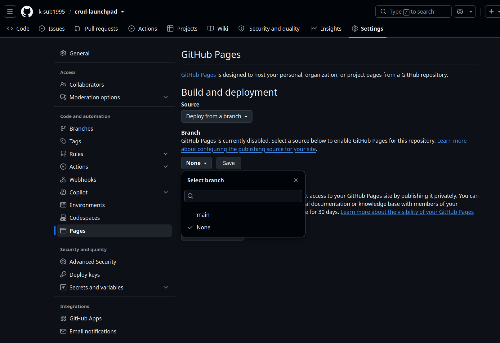
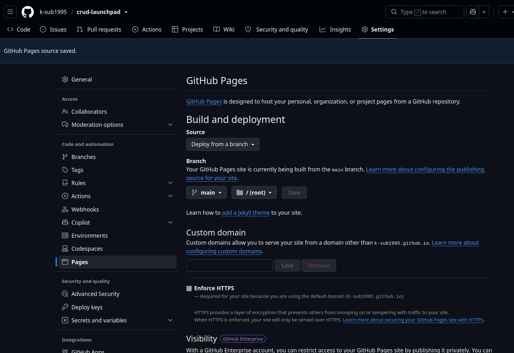
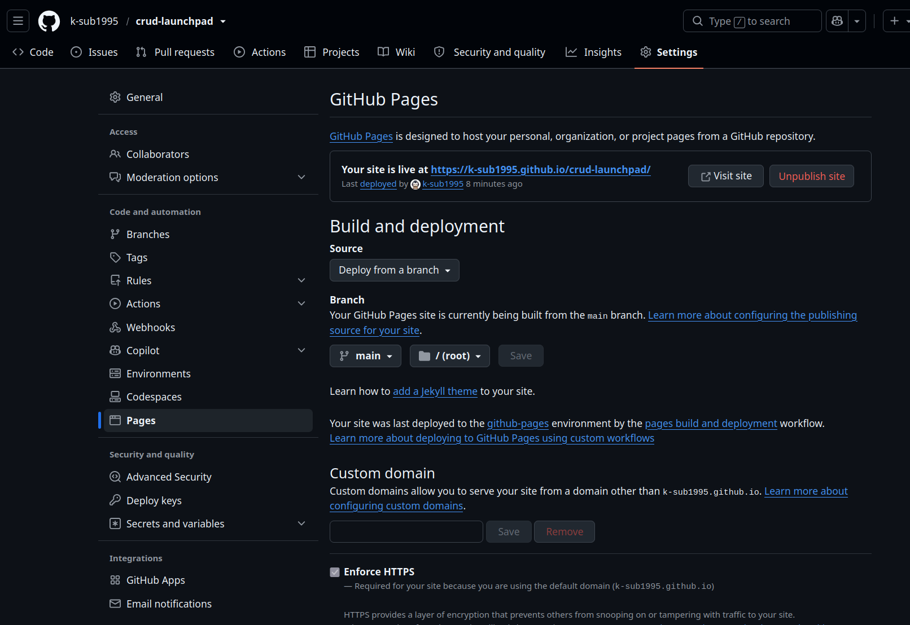
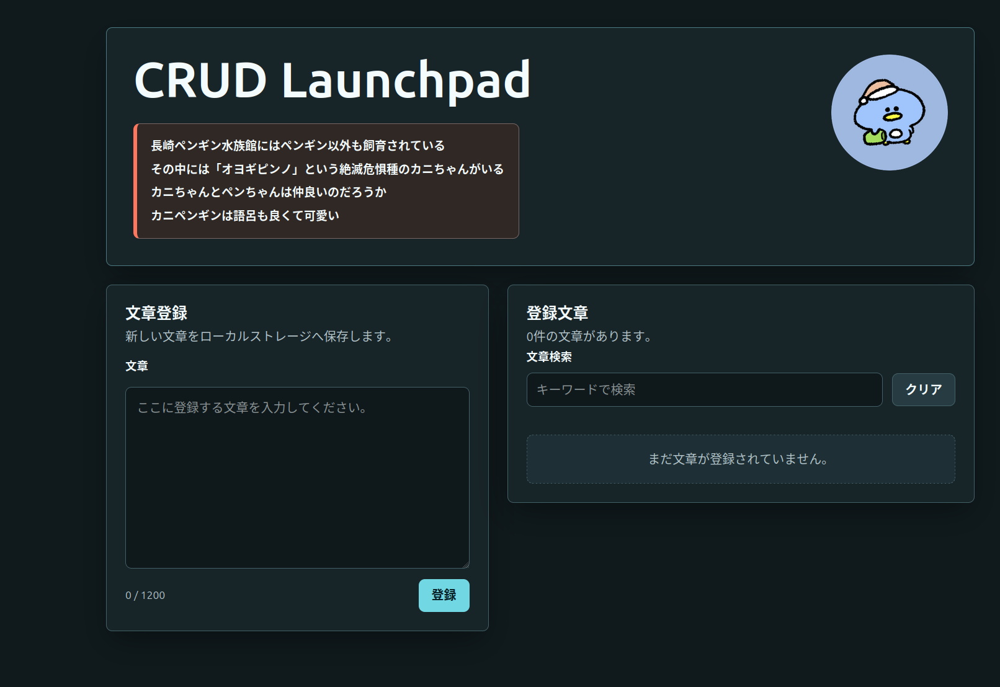

# GitHub Pages GUI公開手順

この手順は、GitHubの画面操作だけで CRUD Launchpad を GitHub Pages に公開するためのものです。
このアプリはビルド不要なので、ブランチからそのまま公開します。

## 前提

- GitHubリポジトリにこのプロジェクトがpushされている
- `main` ブランチ直下に `index.html` がある
- リポジトリの `Settings` を変更できる権限がある

## 手順

1. GitHubで対象リポジトリを開く
2. リポジトリ上部の `Settings` を開く
3. 左サイドバーの `Code and automation` から `Pages` を開く
4. `Build and deployment` の `Source` で `Deploy from a branch` を選ぶ
5. `Branch` で `main` を選ぶ
   
6. フォルダで `/(root)` を選ぶ
7. `Save` を押す
   

## なぜ `/(root)` を選ぶのか

このプロジェクトでは、公開したいトップページの `index.html` がリポジトリ直下にあります。

```text
crud-launchpad/
  index.html
```

GitHub Pages は、選択した公開フォルダの中にある `index.html` をトップページとして表示します。
そのため、この構成では `/(root)` を選びます。

例えば `hoge/index.html` を公開したい場合は、公開フォルダとして `/hoge` を選びます。
つまり、公開したい `index.html` が入っているフォルダを選びます。

## 公開URLの確認

設定後、数分待って同じ `Pages` 画面を再読込すると公開URLが表示されます。

リンクからWebサイトに遷移できます。


公開URLの形式は通常、次のどちらかです。

```text
https://<user>.github.io/<repository>/
https://<organization>.github.io/<repository>/
```

本サイトのURLは下記です。

```text
https://k-sub1995.github.io/crud-launchpad/
```

公開URLが表示されない場合は、次を確認します。

- Source が `Deploy from a branch` になっていること
- Branch が `main`、フォルダが `/(root)` になっていること
- Actions タブや Pages 画面でエラーが出ていないこと
- 数分後に `https://<user>.github.io/<repository>/` を直接開けるか確認すること

## このアプリで見るポイント

- `index.html` が表示されること
- アイコン、CSS、JavaScriptが読み込まれること
- localStorageに登録した文章が、同じURLでリロード後も残ること
